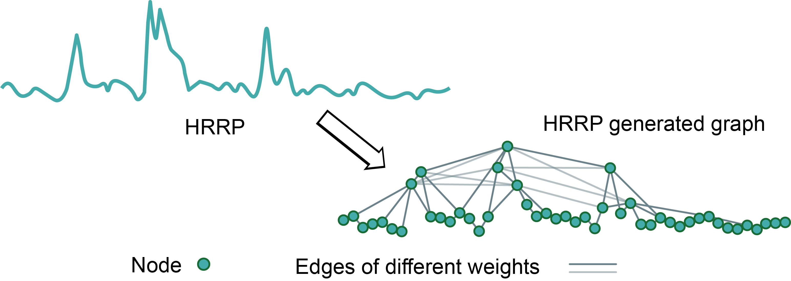

# HRRPGraphNet :satellite: 
**Accepted to IET Electronics Letters 2024** :tada::tada::tada:

HRRPGraphNet revolutionizes HRRP data processing through graph neural networks, achieving efficient radar target recognition :zap:.

---

> HRRP (High-Resolution Range Profile) target recognition faces challenges in handling structural information and intra-class variance. Our work transforms HRRPs into graph structures to better capture local contextual relationships between range cells. The proposed architecture combines multi-scale convolutional layers with graph convolutional networks, enabling effective aggregation of neighborhood features while maintaining structural integrity. Experimental results demonstrate superior recognition accuracy compared to conventional CNN-based methods. The graph-based paradigm opens new possibilities for radar signal processing through geometric deep learning.
><p align="center">
  > 
</p>

---

## Platform :computer: 
Developed and tested on PyCharm with Conda environment. Recommended OS: Linux (Ubuntu 20.04/22.04 LTS).

---

## Getting Started :rocket:
```bash
git clone https://github.com/your-repo/HRRPGraphNet.git
cd HRRPGraphNet
conda create -n hrrpgn python=3.8
conda activate hrrpgn
pip install -r requirements.txt
```

---

## Dataset Structure :file_folder: 
Prepare HRRP data in the following structure:
```
data/
├── train/
│   ├── class1/
│   └── class2/
└── test/
    ├── classA/
    └── classB/
```

## Training & Evaluation :chart_with_upwards_trend:
```python
python main.py --mode train --model HRRPGraphNet --dataset your_data
```
Key arguments:
- `--batch_size`: 64 (default)
- `--learning_rate`: 1e-3
- `--graph_layers`: 3 GCN layers

---

## Citation :blue_book:
If HRRPGraphNet inspires your research, please cite:
```bibtex
@article{chen2024hrrpgraphnet,
  title={HRRPGraphNet: Make HRRPs to be Graphs for Efficient Target Recognition},
  author={Chen, Lingfeng and Sun, Xiao and Pan, Zhiliang and Liu, Qi and Wang, Zehao and Su, Xiaolong and Liu, Zhen and Hu, Panhe},
  journal={Electronics Letters},
  volume={60},
  number={22},
  pages={e70088},
  year={2024},
  publisher={IET}
}
```

---

## License :scroll:
This project is licensed under the MIT License - see the [LICENSE](LICENSE) file for details.

---

## Contact :e-mail:
**Lingfeng Chen**  
:office: National University of Defense Technology  
:email: [chenlingfeng@nudt.edu.cn](mailto:chenlingfeng@nudt.edu.cn)  
:globe_with_meridians: [Personal Homepage](http://lingfengchen.cn/)  
