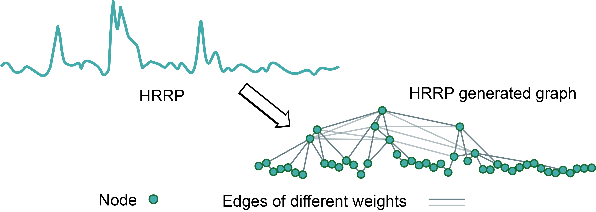

# HRRPGraphNet, IET_ELL_2024 

<div align="right">
  <a href="#english">English</a> | <a href="#chinese">中文</a>
</div>

---

<a name="english"></a>
## English

**Accepted to IET Electronics Letters 2024** :tada::tada::tada:

HRRPGraphNet revolutionizes HRRP data processing through graph neural networks, achieving efficient radar target recognition :zap:.

---

> High Resolution Range Profiles (HRRPs) have become a key area of focus in the domain of Radar Automatic Target Recognition (RATR). Despite the success of deep learning based HRRP recognition, these methods need a large amount of training samples to generate good performance, which could be a severe challenge under non-cooperative circumstances. Currently, deep learning-based models treat HRRPs as sequences, which may lead to ignorance of the internal relationship of range cells. This letter proposes HRRPGraphNet, a novel graph-theoretic approach, whose primary innovation is the use of the graph-theory of HRRP which models the spatial relationships among range cells through a range cell amplitude-based node vector and a range-relative adjacency matrix, enabling efficient extraction of both local and global features in noneuclidean space. Experiments on the aircraft electromagnetic simulation dataset confirmed HRRPGraphNet's superior accuracy and robustness compared with existing methods, particularly in limited training sample condition. This underscores the potential of graph-driven innovations in enhancing HRRP-based RATR, offering a significant advancement over sequence-based methods.

<p align="center">
  
</p>

---

### Platform :computer: 

Developed and tested on PyCharm with Conda environment. Recommended OS: Linux (Ubuntu 20.04/22.04 LTS).

---

### Getting Started :rocket:

```bash
git clone https://github.com/your-repo/HRRPGraphNet.git 
cd HRRPGraphNet
conda create -n hrrpgn python=3.8
conda activate hrrpgn
pip install -r requirements.txt
```

---

### Dataset Structure :file_folder: 

Prepare HRRP data in the following structure:
```
data/
├── train/
│   ├── class1/
│   └── class2/
└── test/
    ├── classA/
    └── classB/
```

---

<a name="chinese"></a>
## 中文

**已被 IET Electronics Letters 2024 接收** :tada::tada::tada:

HRRPGraphNet 通过图神经网络革新了 HRRP 数据处理，实现了高效的雷达目标识别 :zap:。

---

> 高分辨距离像（HRRPs）已成为雷达自动目标识别（RATR）领域的关键研究方向。尽管基于深度学习的 HRRP 识别取得了成功，但这些方法需要大量训练样本才能获得良好性能，这在非合作环境下可能是一个严峻挑战。目前，基于深度学习的模型将 HRRPs 视为序列处理，这可能导致忽略距离单元之间的内在关系。本研究提出了 HRRPGraphNet，一种新颖的图论方法，其主要创新在于使用 HRRP 的图论建模，通过基于距离单元幅度的节点向量和距离相关的邻接矩阵来建模距离单元之间的空间关系，从而能够在非欧几里得空间中高效提取局部和全局特征。在飞机电磁仿真数据集上的实验证实了 HRRPGraphNet 相对于现有方法的优越准确性和鲁棒性，特别是在有限训练样本条件下。这凸显了图驱动创新在增强基于 HRRP 的 RATR 方面的潜力，相比基于序列的方法提供了重大进步。

<p align="center">
  
</p>

---

### 平台 :computer: 

在 PyCharm 和 Conda 环境中开发和测试。推荐的操作系统：Linux（Ubuntu 20.04/22.04 LTS）。

---

### 快速开始 :rocket:

```bash
git clone https://github.com/your-repo/HRRPGraphNet.git 
cd HRRPGraphNet
conda create -n hrrpgn python=3.8
conda activate hrrpgn
pip install -r requirements.txt
```

---

### 数据集结构 :file_folder: 

按以下结构准备 HRRP 数据：
```
data/
├── train/
│   ├── class1/
│   └── class2/
└── test/
    ├── classA/
    └── classB/
```

---

## Citation / 引用 :blue_book:

If HRRPGraphNet inspires your research, please cite:

如果 HRRPGraphNet 启发了您的研究，请引用：

```bibtex
@article{chen2024hrrpgraphnet,
  title={HRRPGraphNet: Make HRRPs to be Graphs for Efficient Target Recognition},
  author={Chen, Lingfeng and Sun, Xiao and Pan, Zhiliang and Liu, Qi and Wang, Zehao and Su, Xiaolong and Liu, Zhen and Hu, Panhe},
  journal={Electronics Letters},
  volume={60},
  number={22},
  pages={e70088},
  year={2024},
  publisher={IET}
}
```

---

## License / 许可证 :scroll:

This project is licensed under the MIT License - see the [LICENSE](LICENSE) file for details.

本项目基于 MIT 许可证发布 - 详情请参见 [LICENSE](LICENSE) 文件。

---

## Contact / 联系方式 :e-mail:

**Lingfeng Chen**  
:office: National University of Defense Technology / 国防科技大学  
:email: [chenlingfeng@nudt.edu.cn](mailto:chenlingfeng@nudt.edu.cn)  
:globe_with_meridians: [Personal Homepage / 个人主页](http://lingfengchen.cn/)
